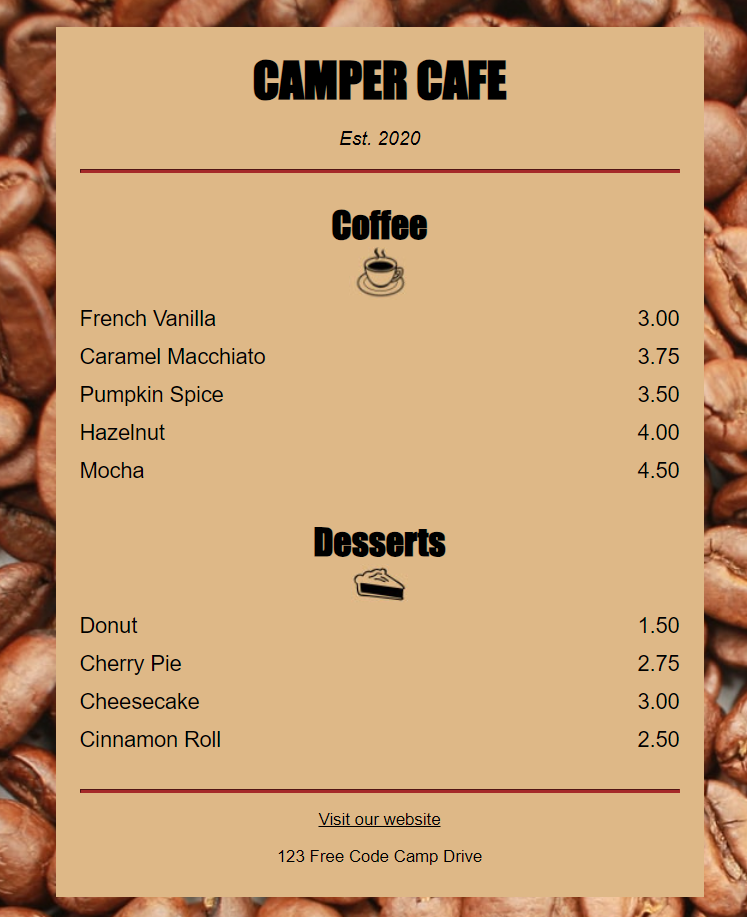

CSS tells the browser how to display the webpage. We can use CSS to set the color, font, size, and other aspects of HTML elements.

In this course, I learnt CSS by designing a menu page for a cafe webpage.

Preview: 
 
 
