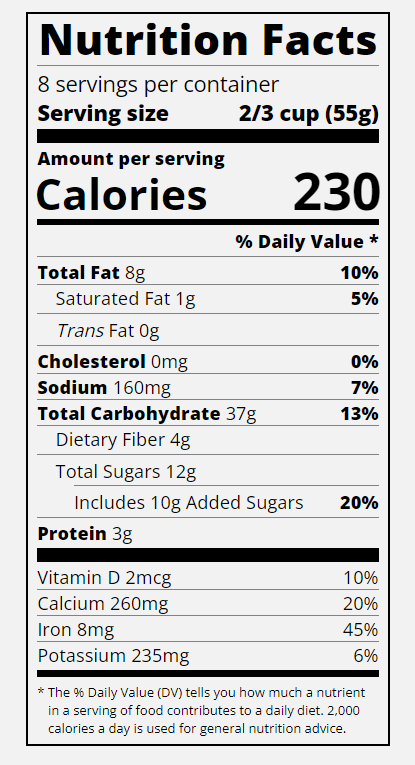

Typography is the art of styling your text to be easily readable and suit its purpose.

In this course, I used typography to build a nutrition label webpage. I learnt how to style text, adjust line height, and position text using CSS.

Preview:
 
 
