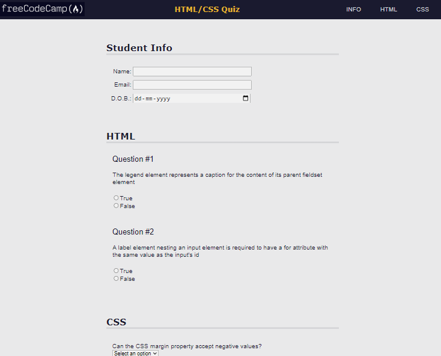
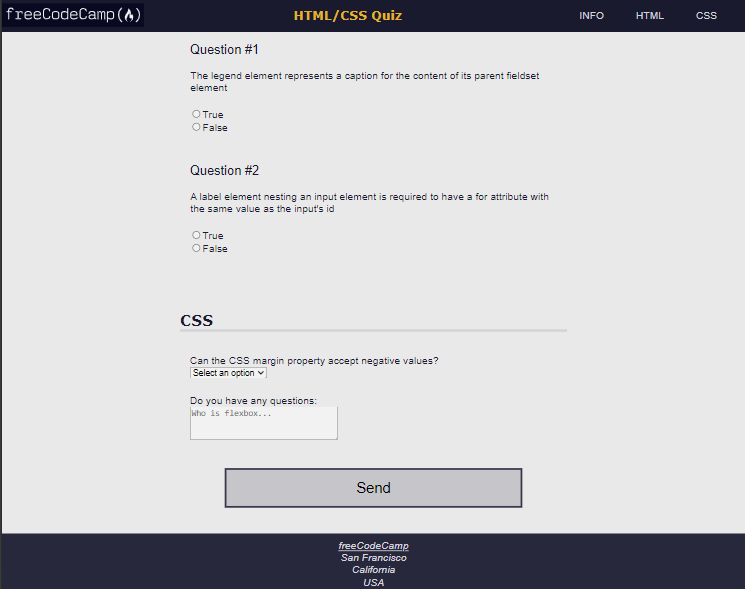

Accessibility is making your webpage easy for all people to use – even people with disabilities.

In this course, I built a quiz webpage. I learnt accessibility tools such as keyboard shortcuts, ARIA attributes, and design best practices.

