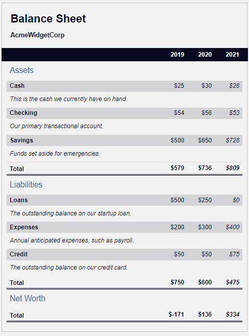

You can use CSS pseudo selectors to change specific HTML elements.

In this course, I built a balance sheet using pseudo selectors. I learnt how to change the style of an element when you hover over it with your mouse, and trigger other events on the webpage.

Preview:
 
 
