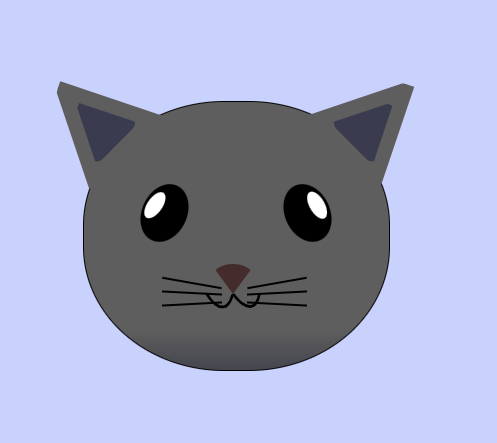

Mastering CSS positioning is essential for creating visually appealing and responsive web layouts

In this course, I built a cat painting. I learnt about how to work with absolute positioning, the z-index property, and the transform property.

Preview:
 
 

 
 
 

CSS positioning lets you set how you want an element to be positioned in the browser. It has a `position` property you can set to `static`, `absolute`, `relative`, `sticky` or `fixed`.

Once you set the position property of the element, you can move the element around by setting a pixel or a percentage value for one or more of the `top`, `right`, `left`, or `bottom` properties.

- `static` is the default positioning for all elements. If you assign it to an element, you won't be able to move it around with top, right, left, or bottom.

- When you use the `relative` value, the element is still positioned according to the normal flow of the document, but the top, left, bottom, and right values become active.

- When you use the `absolute` value for your position property, the element is taken out of the normal flow of the document, and then its position is determined by the top, right, bottom, and left properties.
  
top, left, bottom, right for `absolute` applies in reference to nearest positioned parent/ancestor. Few exception: transform, filter and perspective properties also make a element act like positioned.

- `fixed` is a position property value that lets you make an element fixed to the page no matter where the user scrolls to on the page.

- `sticky` positioning is a hybrid of relative and fixed positioning. It allows an element to stick to a specific position within its containing element or viewport, based on the scroll position.