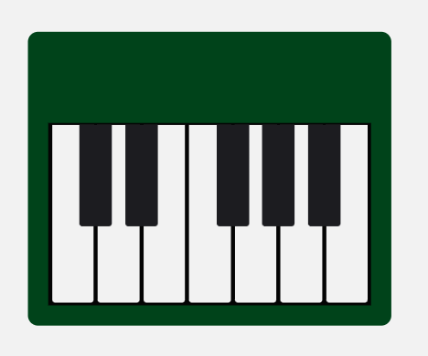
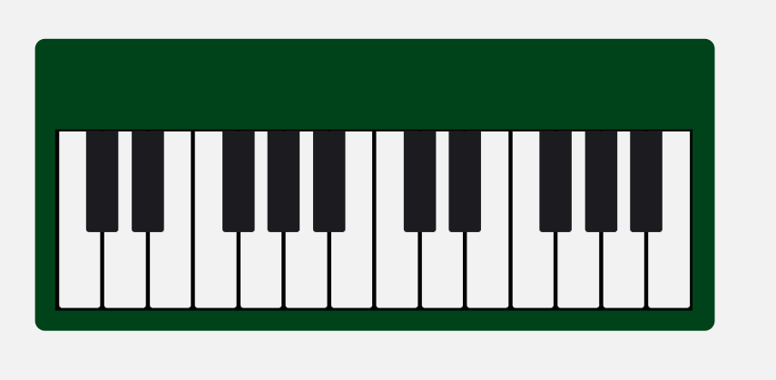
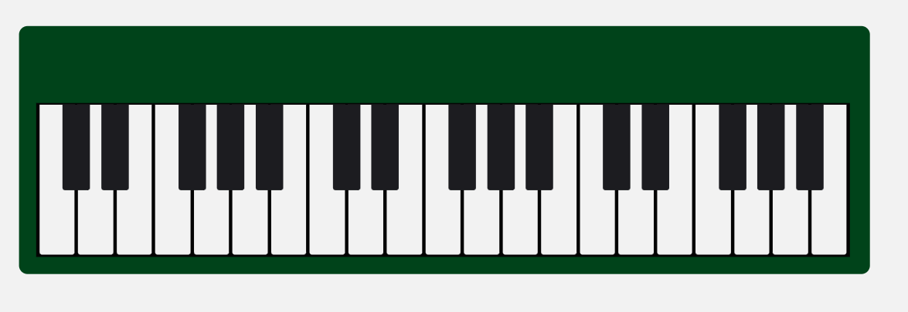

Responsive Design tells your webpage how it should look on different-sized screens.

In this course, I used CSS and Responsive Design to code a piano. I also learnt more about media queries and pseudo selectors.

Preview:
 
 

 

 

 
 

The `content` property is used to set or override the content of the element. By default, the pseudo-elements created by the `::before` and `::after` pseudo-selectors are empty, and the elements will not be rendered to the page. Setting the `content` property to an empty string "" will ensure the element is rendered to the page while still being empty.